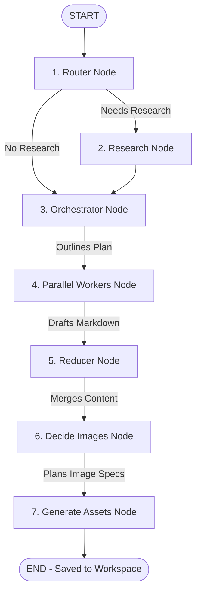

# ✍️ Blog Writing Agent - Premium Streamlit Web Application

An advanced AI-powered blogging workstation built with **LangGraph**, **LangChain**, and **Streamlit**. It automates the process of researching the web, drafting sections in parallel, planning images, generating diagrams, and compiling complete production-ready Markdown articles.

This application is fully optimized to run **100% for free** using **Groq** (for fast text generation), **DuckDuckGo** (for keyless web search), and **Pollinations AI** (for keyless image generation).

---

## 🚀 Key Features

* **Multi-Agent Orchestration:** Powered by a LangGraph state graph separating planning, routing, research, drafting, and asset compilation.
* **100% Free AI Tier:**
  * **Text/Reasoning:** Uses free **Groq** endpoints (`llama-3.3-70b-versatile` by default) or **Hugging Face** serverless text endpoints.
  * **Web Search:** Keyless **DuckDuckGo Search** (no API key required). Falls back to **Tavily** if a key is provided.
  * **Image Assets:** Keyless **Pollinations AI** (no API key required). Falls back to Hugging Face or Gemini if keys are provided.
* **Smart Rate-Limit Management:** Integrates automatic retry handling (with exponential backoff and sleep cooldown) for Groq API RateLimitErrors (HTTP 429).
* **Premium User Interface:** Modern, responsive dark-themed workspace built with Streamlit, custom HSL styling, and Plus Jakarta Sans/Outfit fonts.
* **Visual Asset Packaging:** Generates relevant diagrams/visuals via AI, inserts placeholders inline, and renders the layout dynamically.
* **Production Ready Download:** One-click downloads for raw Markdown documents or complete Zip Bundles containing the text and all generated local images.
* **Historical Loading:** Select and read previous blog posts directly from your workspace directory.

---

## 🛠️ Local Setup and Installation

Follow these steps to run the application on your local machine:

### 1. Clone or Move to the Repository
Ensure you are inside the project folder:
```bash
cd blog-writing-agent
```

### 2. Create a Virtual Environment
Set up a clean Python virtual environment (Python 3.10+ recommended):
* **Windows (PowerShell):**
  ```powershell
  python -m venv .venv
  .venv\Scripts\Activate.ps1
  ```
* **macOS / Linux:**
  ```bash
  python3 -m venv .venv
  source .venv/bin/activate
  ```

### 3. Install Dependencies
Install all required libraries locked in `requirements.txt`:
```bash
pip install -r requirements.txt
```

### 4. Configure Environment Variables
Create a `.env` file in the root of the project. You can copy the template from `.env.example`:
```bash
cp .env.example .env
```

Open `.env` and fill in your keys. To run the app with **Groq**, simply paste your Groq key:
```env
# Required for Groq (Free API Tier):
GROQ_API_KEY=your_groq_key_here

# Optional: To use Hugging Face (Free default)
HUGGINGFACE_API_KEY=your_huggingface_token_here

# Optional: To use paid/fallback providers
OPENAI_API_KEY=
GOOGLE_API_KEY=
TAVILY_API_KEY=
```

---

## 💻 Running the Application

Start the Streamlit web server locally:
```bash
python -m streamlit run app.py
```
This will start the application and open it automatically in your web browser (usually at `http://localhost:8501`).

---

## ☁️ Deployment to Streamlit Community Cloud

Deploying to **Streamlit Community Cloud** is free and easy:

1. **Push to GitHub:**
   Ensure your code is pushed to your GitHub repository:
   ```bash
   git add .
   git commit -m "Configure production app.py and requirements"
   git push origin main
   ```
2. **Deploy on Streamlit:**
   * Go to [Streamlit Share](https://share.streamlit.io/) and log in with your GitHub account.
   * Click **New app**.
   * Select your repository (`blog-writing-agent`), branch (`main`), and set the main file path to `blog-writing-agent/app.py`.
3. **Configure Secrets:**
   * In the app deployment page, click **Advanced settings**.
   * Under **Secrets**, copy the contents of your local `.env` file:
     ```toml
     GROQ_API_KEY = "your_groq_key_here"
     HUGGINGFACE_API_KEY = "your_huggingface_token_here"
     ```
   * Click **Save** and deploy!

---

## 🧩 AI Workflow Architecture



---

## 📝 Project File Structure

* `app.py`: High-fidelity Streamlit frontend entrypoint.
* `bwa_backend.py`: Under-the-hood LangGraph workspace and AI pipeline.
* `requirements.txt`: Python package specifications.
* `.env`: Active local settings file (contains API keys, ignored by git).
* `.env.example`: Template for configuration settings.
* `images/`: Folder where generated images are automatically saved and served.
